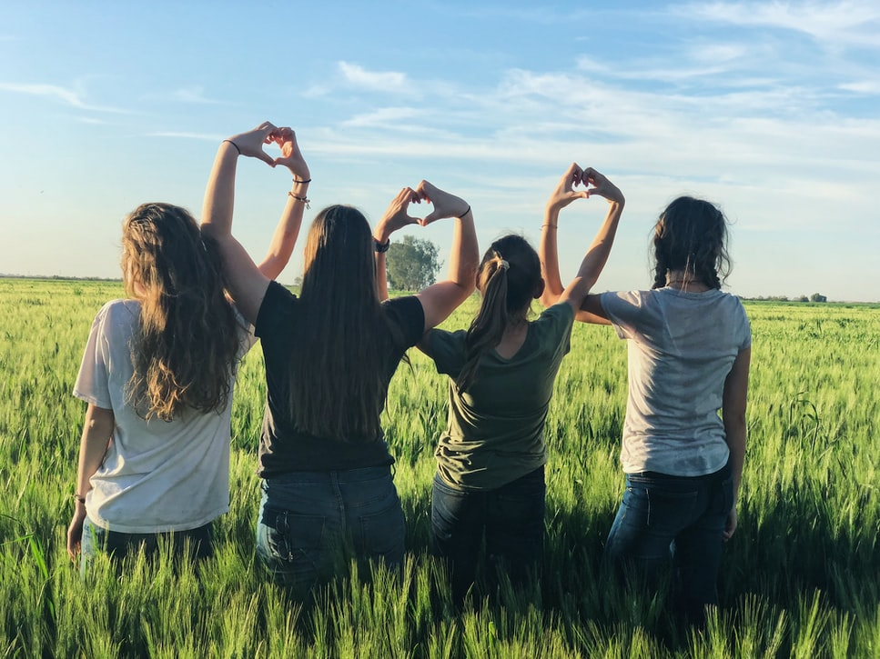
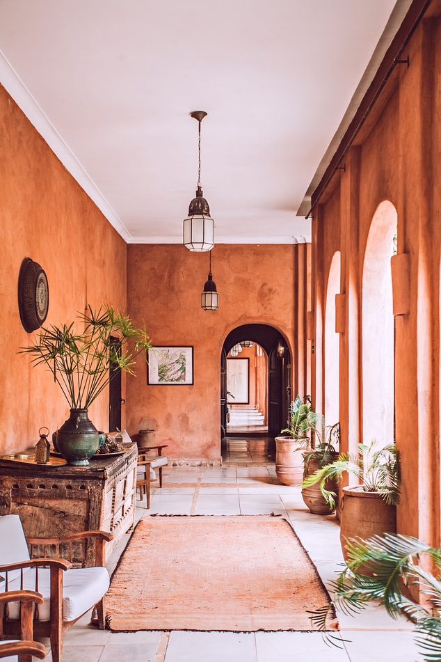
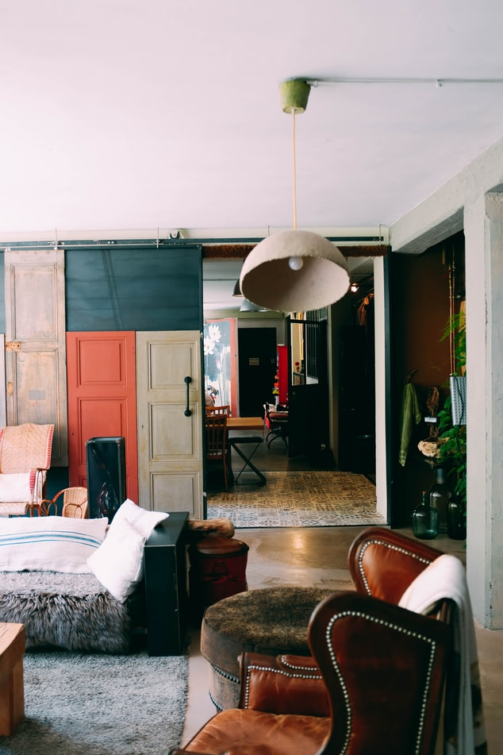

<!DOCTYPE html>
<html lang="en">

<head>
    <meta charset="UTF-8">
    <meta name="viewport" content="width=device-width, initial-scale=1.0">
    <title>The Shealter</title>
    <link rel="stylesheet" href="public\css\project.css">
    <link
        href="https://fonts.googleapis.com/css2?family=Anton&family=Montserrat:wght@100;400&family=Oswald:wght@700&display=swap"
        rel="stylesheet">
    <link
        href="https://fonts.googleapis.com/css2?family=Anton&family=Montserrat:wght@100&family=Oswald:wght@700&display=swap"
        rel="stylesheet">
    <link
        href="https://fonts.googleapis.com/css2?family=Anton&family=Montserrat:wght@100;400&family=Oswald:wght@700&family=Quicksand:wght@500&display=swap"
        rel="stylesheet">
    <link href="https://fonts.googleapis.com/css2?family=Montserrat:wght@200&display=swap" rel="stylesheet">
    <link href="https://fonts.googleapis.com/css2?family=Montserrat:wght@200;400&display=swap" rel="stylesheet">
    <link rel="stylesheet" href="https://unpkg.com/aos@next/dist/aos.css" />
    <link href="https://fonts.googleapis.com/css2?family=Open+Sans+Condensed:wght@300&display=swap" rel="stylesheet">
    <link href="https://fonts.googleapis.com/css2?family=Lato:ital,wght@1,700&display=swap" rel="stylesheet">
    <link href="https://fonts.googleapis.com/css2?family=Oswald:wght@300&family=Yanone+Kaffeesatz:wght@300&display=swap" rel="stylesheet">
    
    <link rel="stylesheet" href="public\css\responsive.css">
    <link rel="icon" href="public/img/slogo1.png" type="image/icon type">
    

</head>

<body>
    <header class="firstbgimage">
        

            

                

                    
                

                

                    <ul>
                        <li><a href="#" class="navbaritems">HOME</a></li>
                        <li><a href="#" class="navbaritems aboutss">ABOUT</a></li>
                        <li><a href="#" class="navbaritems exploress">EXPLORE</a></li>
                        <li><a href="#" class="navbaritems storiesss">STORIES</a></li>
                        <li><a href="#" class="navbaritems galleryss">GALLERY</a></li>
                    </ul>
                

                
                

                
            

                <h1 class="primaryfont" id="h1heading">WELCOME TO THE SHELTER</h1>
                
A chance to go <i>offline</i> and get in touch with nature.
                

            

            

                

                    

                        <label for="btn1" class="btntext">Check-in</label>

                    <input type="text" id=btn1 class="btnbox" placeholder="12 Feb">
                

                

                    
 <label for="btn2" class="btntext">Check-out</label>

                    <input type="text" id=btn2 class="btnbox" placeholder="11 March">
                

                

                    
 <label for="btn3" class="btntext">Guests</label>

                    <input type="text" id=btn3 class="btnbox" placeholder="3">
                

                <input type="submit" value="BOOK NOW" id="booknow">

            

            <input type="submit" value="BOOK NOW" id="booknow2">

        

    </header>
    <section class="smoothscrolling1">
        

            

                <h1>The shelter is the outcome of the dream
                </h1>
                
Triple-mint renovation commodo ligula eget dolor

            

        

        

            

                

                    <h1>Quietness Designed</h1>
                    
Lorem ipsum dolor sit amet consectetur adipisicing elit. Consequatur veritatis delectus quae
                    

                

                

                    <h1>Outdoor Skies</h1>
                    
Lorem ipsum dolor sit amet consectetur adipisicing elit. Consequatur veritatis delectus quaerat
                

                

                

                    <h1>Nothing More</h1>
                    
Lorem ipsum dolor sit amet consectetur adipisicing elit. Consequatur veritatis delectus quaerat
                .

                

                

            

    </section >
  
        

            

                <h1>Explore the shealter</h1>
            

            

                

                
                        
                        
                        
                        
                        
                        
                        
                        
                    

                    

           

            
             
                <i class="fas fa-arrow-left" class="prev" onclick="prevtoggle2()" id="prevbtn2"></i>
                <i class="fas fa-arrow-right" class="next" onclick="nexttoggle2()" id="nextbtn2"></i>
            

        

            

        
    </section >

    <section class="customer-reviews smoothscrolling2">
        

            

                

                    PEOPLE AND STORIES 

                <h2 class="h2">The choice of shealter</h2>
                
Lorem ipsum dolor sit amet consectetur adipisicing elit. Tempora iste iure optio
                    eum! Reprehenderit laudantium soluta, nisi.

            

            

                
                

                    
" To get out of the city with all

                    
 the necessities and nothing more "

                    
AYUSH GUPTA

                

            
            

            

                
                

                    
" The nature interact as a piece of furniture

                    
 with such a prominent place "

                    
TOMMY SINGH

                

            

        

        

            

            

                
                

                    
" A unique space to unload and recharge 

                    
even with your childs"

                

                
MARTIN GUPTA

            

            

                
                

                    
"" A place with nature omnipresent and

                    
 the landscape purposely framed "

                

                
DEEPIKA PODUKONE

            

        

    </section>
    <section class="theroom  smoothscrolling4">
        
The Room
        

        

            

                

                    

                        
                        

                            <h3>THE ROOM</h3>
                            <h1>Comfort of home</h1>  
                            
Lorem ipsum dolor sit amet consectetur, adipisicing elit. Accusantium minima amet autem similique culpa soluta temporibus. 
                            
                        
>
                    

                    

                        
                        

                        <h3>THE ROOM</h3>
                        <h1>Stylish interiors</h1>  
                        
Lorem ipsum dolor sit amet consectetur, adipisicing elit. Accusantium minima amet autem similique culpa soluta temporibus. 
                            
                    

                    

                    

                        
                        

                            <h3>THE ROOM</h3>
                            <h1>Nature in front of you</h1>  
                            
Lorem ipsum dolor sit amet consectetur, adipisicing elit. Accusantium minima amet autem similique culpa soluta temporibus. 
                            
                        

                    

                    

                        
                        

                            <h3>THE ROOM</h3>
                            <h1>Comfort of Home</h1>  
                            
Lorem ipsum dolor sit amet consectetur, adipisicing elit. Accusantium minima amet autem similique culpa soluta temporibus. 
                            
                        

                    

                    

                        
                        

                            <h3>THE ROOM</h3>
                            <h1>Stylish interiors</h1>  
                            
Lorem ipsum dolor sit amet consectetur, adipisicing elit. Accusantium minima amet autem similique culpa soluta temporibus. 
                            
                        

                    

                

            

            

            

                <i class="fas fa-arrow-left" class="prev" onclick="prevtoggle()" id="prevbtn"></i>
                <i class="fas fa-arrow-right" class="next" onclick="nexttoggle()" id="nextbtn"></i>

            

        

        

    </section>
    <section class="video">
        

            
A POD OF PEACE DESIGNED AS A LARGE-SCALE

            <h1>We offer unique shelter at various destinations</h1>
        

        
        <video  autoplay loop muted>
            <source src="public/img/vide.mp4" type=video/mp4>
          </video>
         
        
    </section>

    <footer class="blackbackground">

        

        

            
Designed and created by AYUSH GUPTA

        

        

          
  © All rights reserved

        

    

    </footer>
 

    
    
    

</body>

</html>